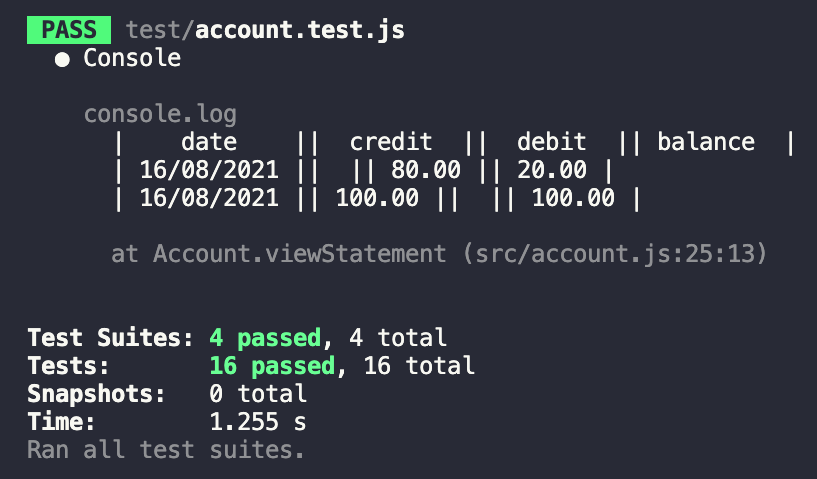

# Bank Technical Test in Javascript


## Overview
Solo project to solve a technical challenge with a focus on clean well crafted code. 
Program allows user to manage finances through a simple command line interface. 

## Personal Objectives: 
* To approach planning meticulously
* To write DRY, readable, clean code from scratch that is easy to update and manage.
* High test coverage (>95%)
* To learn how to use a new testing framework (Jest)
## Setup 
```
$ git clone git@github.com:fwill22/bank-tech-test-JS.git
$ cd bank-tech-test-JS
$ yarn install
$ node
```

## How to use
In REPL:
```
> let connection = require('./src/account')
> let account = new connection
> account.deposit(1000.75)
> account.withdraw(800)
> account.balance()
> account.viewStatement()

```

## Testing and Linting
### Run Tests
```
yarn test
```
<details>
<summary> Jest Results </summary>
<br>



</details>
<br>

### Run Linting
```
yarn lint
```
<br>

## Planning and Approach: 
### User Stories
```
As a user
So I can be part of a cashless economy
I want to be able to open an empty bank account, with a starting balance of £0.
```
```
As a user
So I can store my money securely
I want to be able to deposit it into my account
```
```
As a user
So I can buy things untracked 
I want to be able to withdraw money from my account
```
```
As a user
So I can have emergency funds
I would like to have an overdraft limit
```
```
As a user
So I can check how much money I have saved
I want to be able to see my current account balance and transaction history on a printed statement.
```
```
As a user
So I can keep on top of my money habits
I want my account statement to display the date, transaction amount, type, and updated balance.
```
```
As a user
So I can see an up to date history of my transactions
I want to be able to see my account statement listed in reverse chronology by date created
```

#### Edge cases:
```
As a user
So I can stay in the black
I want my account to prevent withdrawal if I have insufficient funds

As a bank manager
So I can ensure the efficient operation of my business
I want to be able to notify customers if they are depositing or withdrawing amounts ≤ £0. 

As a user
So I know I am adding real money
I want to be notified if I try to enter anything other than an integer or float
```

### Domain Model

Class     | Account  |
--------- |----------|
Properties| opening_balance, overdraft limit, transaction history, statement_class, transaction_class
Actions   | deposit, withdrawal, balance, sufficient_funds?, print_statement, save_transaction


Class  | Transaction |
---------|----------|
 Properties | Date, Type, Amount, Current Balance | 
 Actions | constructor | 

 Class  | Statement |
---------|----------|
 Properties | | 
 Actions | format(date), format(amount), format(transaction), format(header), format(statement), print(transaction_history)| 

 
<br>

### CRC Cards

<details>
  <summary> CRC Cards </summary>

**Account**: <br>
| *Responsibilities*:  | *Collaborators*: |
-----------------------|------------------|
|Knows about:          |  Transaction, Statement |

</details>
<br>

### Planning Notes & Ideas: <br>

<details> 
  <summary> [Draft] </summary>

 * withdrawal [- if sufficient_funds?] - add to transaction_history (private method) <br>
 * balance (iterates through transaction history) and  <br>
 * @transaction_history = [] 
  
 </details>
<br>

### Reflections [Notes on changes/adaptations to design/models]

* 
*
*
<br>

<details>
<summary> Feedback </summary>
> Positive <br>
> To improve
[ ] 
</details>
<br>

## Dependencies
* JavaScript
* Node
* Jest
* ESLint
* Husky

## Requirements
You should be able to interact with your code via the JavaScript console.
Deposits, withdrawal.
Account statement (date, amount, balance) printing.
Data can be kept in memory (it doesn't need to be stored to a database or anything).
### Acceptance Criteria
Given a client makes a deposit of 1000 on 10-01-2012<br>
And a deposit of 2000 on 13-01-2012 <br>
And a withdrawal of 500 on 14-01-2012 <br>
When she prints her bank statement she would see:
```
|    date     ||  credit  ||  debit  || balance  |
 ------------------------------------------------
|  14/01/2012 ||          || 500.00  || 2500.00  |
|  13/01/2012 || 2000.00  ||         || 3000.00  |
|  10/01/2012 || 1000.00  ||         || 1000.00  |
```
---------------------------
## Ruby Version
I have also written this project in Ruby - you can find the repo [here](https://github.com/fwill22/bank-tech-test-ruby).
